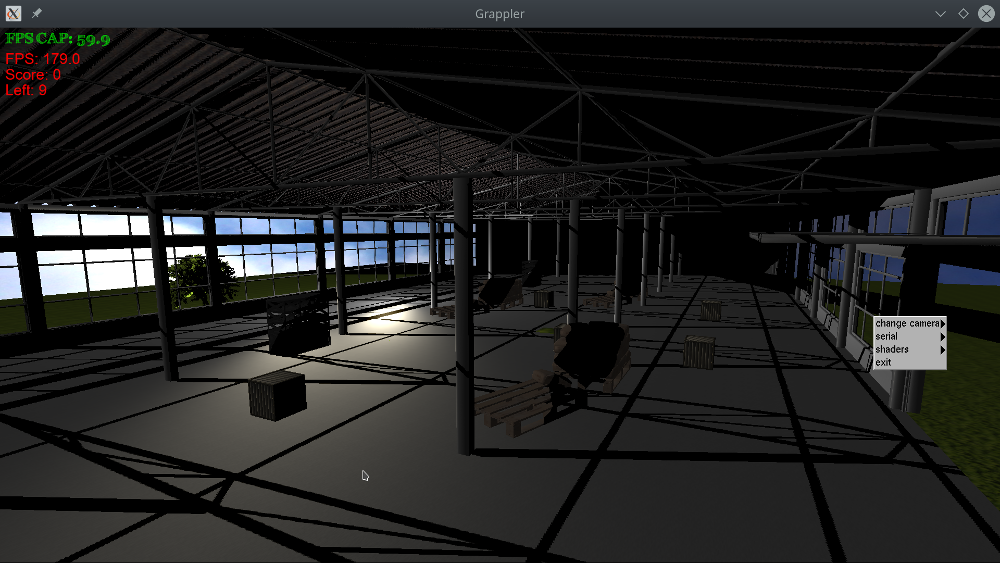
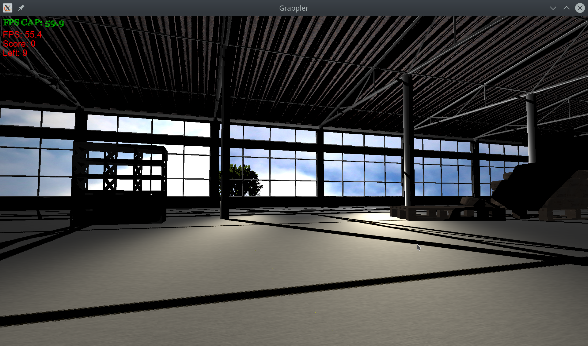
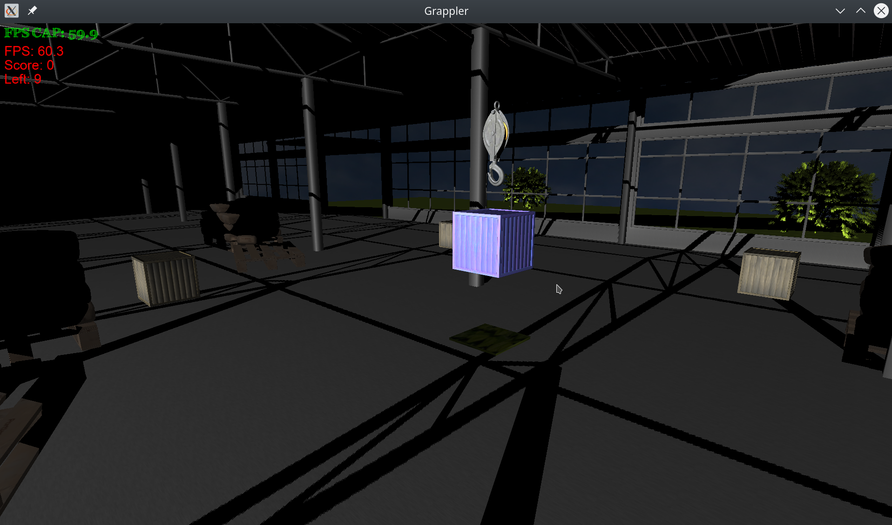
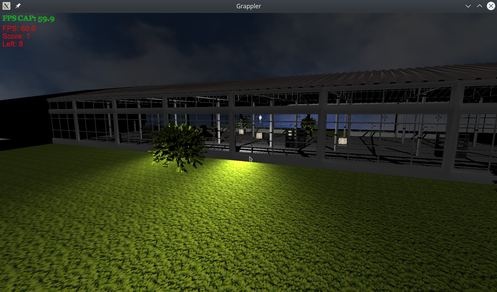
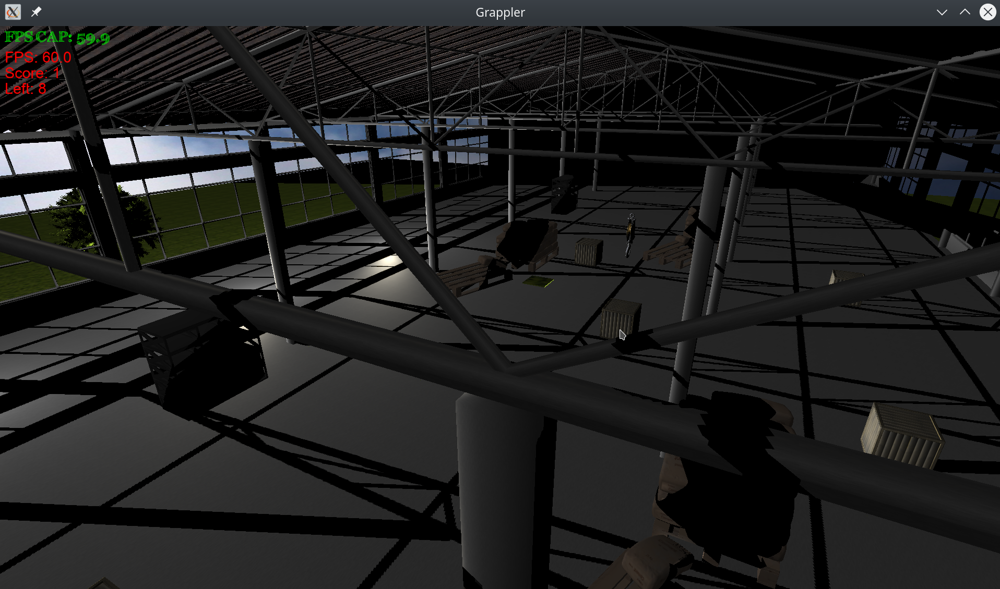

# Grappler
This is application that simulates grappler. It is written in plain c++ and opengl.
Grappler can move in rendered scene and pickup boxes that are part of the game.
Main goal is to place boxes in green area to gain points.

## Technologies used:
- c/c++
- python
- opengl
- opengl sl
- freeglut
- glew
- soil
- serial

# Features

## Context menu
The menu is available after pressing the right mouse button in the program.
- exit - exit from the program (also as ESC key)
- shaders - change the shaders used in the program
- serial - change of listening the serial port (in the form of printf)
- camera - change the camera mode

## Camera
Looking at the camera is possible by using the mouse.
The camera is operated in two modes:

### Free camera
This is the so-called slow camera, you can move it regardless of the scene.
Moving the camera is possible by using the keys:

- w / scroll up - move forward
- w / scroll down - move backwards
- a - move left (strafing)
- d - move right (strafing)

### Third person
A third-person camera is directly related to the Grappler object (akinally wolf).
In this case, it is possible to use the 'w, a, s, d' keys to move the camera together
with grappler.

## Shaders
There are currently 3 different 'fragment shaders' whose change modifies the current ones
stage light, available lights:
- fragment - default light
- fragment_directional - light referral
- fragment_spotlight - flashlight light

Materials have been added to all shaders.

## Textures
Texture loading is done using the SOIL library, which allows the use of textures in a format other than bmp, which saves disk space.

## Fps
There is a timer in the main loop of the program that refreshes scene 60
frames per second.

## Serial
A class has been written that allows serial communication in the main loop of the program
with devices connected via usb or virtual (socat)

## Gravitation
Gravitation is implemented using timer in main glut loop that calculates next positions for all falling objects (boxes)

## Keyboard 
Without controller grappler can be controlled with arrow keys in free camera mode with spacebar to pick up items and '+'/'-' to move it vertically.

## Shadow
Shadow are generated for warehouse program with shadowmap generated in one of shaders and displayed along other objects.

## Light and material
Light and materials are passed to shaders as uniform values for later calculation.

# Controller
A dedicated architecture-based controller has also been created as part of the project
AVR ATmega328 with serial port CH340. Elements used:
- arduino nano microcontroller
- oled display
- MPU6050 accelerometer / gyroscope
- potentiometer
- joystick

The controller works in joystick or accelerator mode.
Moving the grapler in the x / z axis is possible using the x / y axis of the joystick or accelerator. The y axis is controlled by a potentiometer and it is absolute,
which means that setting a specific value for the y axis causes the object to stop there, rather than setting its velocity vector.

The controller communicates with the program via serial port and sending checklist
communication frame in the form of "float / float / float" (x axis / z axis / y axis) with a set maximum value range (the actual data resolution is from -1000 to 1000)

Running the program with the controller requires entering its name given by the os and baud rate.

Locating the device port on the linux system is possible using the command:

```bash
dmesg | grep 'tty'
```

example feedback:

```bash
[    0.097615] printk: console [tty0] enabled
[    1.043506] 00:04: ttyS0 at I/O 0x3f8 (irq = 4, base_baud = 115200) is a 16550A
[    1.136305] tty ttyS13: hash matches
[ 8565.271845] usb 1-6: ch341-uart converter now attached to ttyUSB0
```

So our controller has the name:

```bash
/dev/ttyUSB0
```
Prędkość urządzenia jest wyświetlana na ekranie oled i musi być podana wraz z nazwą
urządzenia podczas staru programu.

An example of starting the program:

```bash
./run.sh src /dev/ttyUSB0 115200
```
The script `run.sh` is responsible for compiling and running the program.
The first argument is the path where the program is located (src), the second argument
is the name of the device, the third is the transmission speed.

Of course, the program can be started without a controller connected, and in this case
all functions will be retained with the exception of grappler control via the controller.

# Controller simulation
It is also possible to simulate the work of the controller using software.

In this case, you need to create virtual serial ports using socat.
This program creates 2 serial ports that are coupled and you can use one of them as input to the opengl program, and 2 as an output from a script simulating the work of a controller written in the `GrapplerMove.py` python.

## Launching virtual ports
Ports can be started by using the command:

```bash
socat -d -d pty,raw,echo=0 pty,raw,echo=0,b115200
```

where the b115200 argument is the baud rate and it must be identical for everyone
transmission medium.

Sample program output:

```bash
2020/05/02 15:59:32 socat[6773] N PTY is /dev/pts/2
2020/05/02 15:59:32 socat[6773] N PTY is /dev/pts/3
2020/05/02 15:59:32 socat[6773] N starting data transfer loop with FDs [5,5] and [7,7]
```
means that serial ports named "/ dev / pts / 2", "/ dev / pts / 3" have been started
and a speed of 115,200 baud (bits per second).

## Example launch
Refer to the above information to run the program with the controller simulation
run the commands:
`` Bash
./run.sh src / dev / pts / 2 115200
python GrapplerMove.py / dev / pts / 3 115200
`` `
Then, through input to the python script, we can perform predefined grappler moves.

# Starting the program
It is assumed that the program will be run on linux, so you should do it first
install the required libraries by running the script `install_libs.sh`,
then you can run the program using the command:
``` Bash
./run.sh src <controller port> <baud rate>
```
if the program is to be run without a microcontroller you can replace the port and speed
provide any arguments, in this way the program will be notified that the given device is not under the current setting and serial transmission will not be established, for example:
```Bash
./run.sh src arg1 ar2
```
Starting the program in simulation mode is described in the chapter `` Controller simulation ''.

# Content of source files
- firmware -> firmware written for microcontroller
    - libs -> additional libraries
    - grappler_driver -> microcontroller firmware
- img -> images used for readme
- src -> main folder with program code
    - libs -> folder with additional libraries (3rd party)
    - objects -> folder with objects .obj files
    - shaders -> folder with shaders
        - depthmapfragment.glsl -> fragment shader for depthmap (idle)
        - depthmapvertex.glsl -> calculating shadowmap
        - fragment.glsl -> basic fragment shader for all programs
        - fragment_directional.glsl -> with directional lighting
        - fragment_sky.glsl -> shader for calcualting pixels on the sky
        - fragment_spotlight.glsl -> with spotlight light
        - text-ft* -> for displaying text in 2d format
        - vertex.glsl -> basic vertex shader for all programs
        - vertex_ground -> vertex for texture multiplication
    - textures -> texture folder
    - Camera.hpp -> camera display / movement
    - Grappler.hpp -> grappler display / motion / actions
    - IOHandler.hpp -> bind keyboard / mouse buttons for operation in the main loop
    - Light.hpp -> class containing information about light
    - main.cpp -> main program
    - main.hpp -> main program header with global variables (extern)
    - Material.hpp -> class with static variables of used materials
    - Menu.hpp -> context menu
    - ProgramHandler.hpp -> class containing all information about the object, such as:
        - texture
        - obj matrix (vertices, normal vectors, texture vectors)
        - the current shift / rotation / shaping
        - used shaders
        - lights
    - Serial.hpp -> serial port support
    - Text.hpp -> creating and displaying 2d text on screen
    - Box.hpp -> box class to interact in game
    - Game.hpp -> game handler with ui

# Screenshots








